# Family Call Center

> **Note:** This repository is unmaintained, unsupported, and shared as-is as untested example code.

My kid is years away from a phone of her own but still wants to call people. So I gave a simple corded landline one phone number and something to do behind it.

Call the number and a warm voice (slowed down so a kid can actually follow it) answers: press 1 to leave a message, press 2 for the weather. Press 1 and the recording lands on a Raspberry Pi, gets transcribed, and texts me what she said. Press 2 and she hears today's forecast as a goofy, kid-shaped line (the date, a joke about the sky, what to wear, the temperatures), read twice, then a cheerful goodbye. The weather check texts me too, so I know what she was told. Old voicemails live on a little inbox page I can only open from my own network.

The voice is Deepgram Aura. The transcripts and weather are Deepgram and Open-Meteo. None of it is load-bearing: if Deepgram ever goes quiet, the call falls back to Twilio's built-in voice on its own, and the phone still works.



---

## Features

- Press 1 leaves a voicemail, saves it to the Pi, transcribes it with Deepgram nova-3, and fires a Pushover notification with the transcript
- Press 2 reads a kid-friendly daily weather line (built from Open-Meteo, no API key needed) then hangs up politely; parent gets the text too
- Warm, slowed voice via Deepgram Aura (configurable model and speed); Twilio built-in voice is the automatic fallback
- Pushover pings on every voicemail and weather check
- Private voicemail inbox accessible only over your Tailscale tailnet
- Edit outfit rules, temperature bands, and goofy jokes in `config/wardrobe.yml` without touching Python

---

## How it works

### The voice

Deepgram Aura synthesizes each prompt once. ffmpeg time-stretches it to your `SPEECH_RATE` (pitch stays put, it just slows down), and it caches as an mp3 under `data/audio/`. Twilio fetches the file at `/audio/<file>`. Static prompts warm up at startup, and the daily weather line renders on the scheduler run, so a call never waits on synthesis. Leave `DEEPGRAM_API_KEY` empty and the whole thing falls back to Twilio's built-in `<Say>` voice.



### The weather

Once a day (default 4am, configurable in `config/wardrobe.yml`), the scheduler pulls an Open-Meteo hourly forecast, selects morning and afternoon temperature windows, applies wardrobe rules from `config/wardrobe.yml` and school-day overrides from `config/day_overrides.yml`, picks a goofy weather joke, and renders a single spoken sentence. That sentence is synthesized into a cached mp3 and is ready before the first call of the day.



### Privacy and the inbox

Twilio's webhooks arrive over a named Cloudflare tunnel at a fixed public URL. The voicemail inbox is a separate door: it only responds to requests whose `Host` header matches `TAILNET_HOSTNAME`, so it stays invisible to the public tunnel. Reach it from any device on your Tailscale tailnet at `http://<TAILNET_HOSTNAME>:8080/`.



---

## Running it on a Pi

The phone lives on a Raspberry Pi on my desk. A caller hits the Twilio number, Twilio webhooks a named Cloudflare tunnel at a fixed hostname, and that forwards to the app on the Pi. Your own phone reaches the voicemail inbox a different way, over Tailscale, and that path never touches the public URL.



The named tunnel is what makes it durable. A Cloudflare *quick* tunnel hands you a random URL that changes on every restart, which breaks the Twilio webhook each time (ask me how I know). A named tunnel keeps the same hostname for good. The app and the tunnel both run as `systemd` services, so a reboot or a power cut brings the line back on its own.

The full walkthrough is in [`DEPLOY.md`](DEPLOY.md): the named tunnel, Tailscale for the inbox, both services, and the reboot test.

---

## Quick start (fresh clone)

This is the laptop test: a call from your phone through a throwaway tunnel. For the durable Raspberry Pi setup (a stable URL that survives reboots), see [`DEPLOY.md`](DEPLOY.md).

```bash
git clone <your-repo-url> family-call-center && cd family-call-center
python3 -m venv .venv && source .venv/bin/activate
pip install -r requirements.txt
```

Install the system dependency for the voice slowdown:

```bash
# macOS
brew install ffmpeg
# Raspberry Pi / Debian
sudo apt install ffmpeg
```

Copy and fill in the environment file:

```bash
cp .env.template .env
# then open .env and fill in your keys (see "Accounts and keys" below)
```

Expose the app publicly so Twilio can reach it. A Cloudflare quick tunnel needs no account:

```bash
cloudflared tunnel --url http://localhost:8080
# prints something like: https://abc-123.trycloudflare.com
```

Put that URL in `.env` as `BASE_URL` (https, no trailing slash), then start the app:

```bash
python run.py   # serves via waitress on 0.0.0.0:8080
```

Finally, in the Twilio console set your phone number's Voice webhook to `<BASE_URL>/call` with method `POST`, then call the number from your phone.

---

## Accounts and keys

| Variable | What it is | Where to get it |
|---|---|---|
| `TWILIO_ACCOUNT_SID` | Account SID (starts with `AC`) | [Twilio console](https://console.twilio.com) home, Account Info card |
| `TWILIO_AUTH_TOKEN` | Auth Token (same card) | Twilio console home |
| `TWILIO_PHONE_NUMBER` | Your Twilio voice number (E.164, e.g. `+15550001234`) | Twilio console, Phone Numbers |
| `BASE_URL` | Public tunnel URL (https, no trailing slash) | Printed by `cloudflared` or your named tunnel config |
| `TAILNET_HOSTNAME` | Tailscale MagicDNS hostname of the Pi, no scheme or port | `tailscale status` |
| `DEEPGRAM_API_KEY` | Single key used for both TTS and STT; leave empty to use Twilio voice only | [console.deepgram.com](https://console.deepgram.com) |
| `DEEPGRAM_TTS_MODEL` | Voice model, e.g. `aura-2-luna-en` | Deepgram TTS docs |
| `DEEPGRAM_STT_MODEL` | Transcription model, default `nova-3` | Deepgram STT docs |
| `SPEECH_RATE` | Playback speed (e.g. `0.85` for slower, child-friendly pace); requires ffmpeg when not `1.0` | Set to taste |
| `PUSHOVER_TOKEN` | App token (30 chars) | [pushover.net](https://pushover.net), your application |
| `PUSHOVER_USER` | User key (30 chars) | pushover.net dashboard |
| `WEATHER_LAT` / `WEATHER_LON` | Your coordinates; kept out of git | Maps / GPS app |
| `WEATHER_PLACE_NAME` | Display name for the location, e.g. `Home` | Your choice |
| `DATA_DIR` | Absolute path where recordings and audio cache are stored | Set to wherever you want data on the Pi |
| `FLASK_SECRET_KEY` | Random string; generate with `python3 -c "import secrets; print(secrets.token_hex(24))"` | Self-generated |

Open-Meteo requires no API key.

---

## Stumbling blocks (learned the hard way)

**Use the Account SID, not a Phone Number SID or API Key SID.** The Account SID starts with `AC` and lives on the Twilio console home dashboard. If you paste a `PN` (Phone Number SID) or `SK` (API Key SID) instead, calls may connect but recording downloads will fail silently.

**Upgrade your Twilio account off the trial before letting the family call.** On a Trial account only verified caller IDs can reach your number, and every call opens with a Twilio trial notice. Adding a payment method switches you to pay-as-you-go (roughly a dollar a month for the number plus a few pennies per call), and then any caller can reach the line.

**ffmpeg is required when `SPEECH_RATE` is not `1.0`.** Without it the app logs a warning and serves normal-speed audio; it does not crash. Install it before setting a slowdown value.

**Use Cloudflare Tunnel for the Twilio-facing webhook, not Tailscale Funnel.** Tailscale Funnel returned intermittent HTTP 502s on Twilio's webhook POSTs in testing. Cloudflare Tunnel handled the same traffic without issues. For a stable URL across Pi restarts, set up a named Cloudflare tunnel rather than the quick tunnel (whose URL is temporary).

**Run the app with `run.py`, not Flask's dev server.** `run.py` uses waitress. Twilio's webhook POSTs carry `Expect: 100-continue`; the Flask dev server mishandles this through a tunnel and the edge returns 502. waitress handles it correctly.

**`BASE_URL` must exactly match the public host** (https scheme, no trailing slash). If it drifts from what Twilio actually called, Twilio's request signature validation fails and the app returns 403.

**`PUSHOVER_USER` is your 30-character user key**, not a device name. Find it on the pushover.net dashboard under your account.

Full troubleshooting with copy-paste CLI commands for the Twilio debugger, Pushover validation, and webhook updates lives in [`SETUP.md`](SETUP.md).

---

## Docs

- [`docs/user-guide.html`](docs/user-guide.html) - read-cold, illustrated guide; open in a browser
- [`SETUP.md`](SETUP.md) - Raspberry Pi setup walkthrough, systemd service, and detailed troubleshooting

---

## Why this repo exists

This repo is a lightweight public wrapper around a personal project so people can see the rough implementation. A link to the full write-up will appear here once it is published.

---

## Project status and disclaimers

- This project is shared as an **example/sketch**, not production-ready software.
- I am **not providing support** for this repository.
- The code is **lightly tested / untested in many environments**.
- Reuse or adapt it at your own risk.
- Treat this as a starting point for experimentation, not a maintained package.
